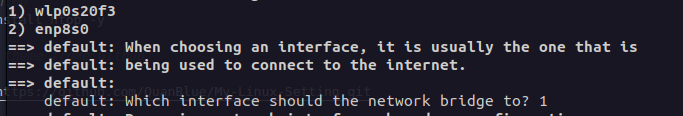
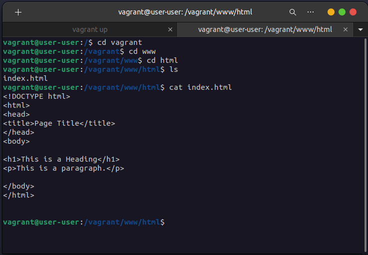

# Vagrant-VirtualBox

## Prerequire

Install plugin

```
vagrant plugin install vagrant-disksize
```

## Run

Run terminal command to auto init VM on VirtualBox by Vagrantfile script

```sh
vagrant up
```

After complete install VM, ssh to remote control that VM by CLI

```sh
vagrant ssh
```

Choose internet interface


Check sync folder `v-root`


### Login User

> **usr**: root  
> **pwd**: root

> **usr**: vagrant  
> **pwd**: vagrant

## Explain code

Copy folder `v-root` in local into VM in directory `/vagrant`

```ruby
config.vm.synced_folder 'v-root', '/vagrant'
```

Run shell script in `bootstrap.sh`

```ruby
config.vm.provision :shell, path: "bootstrap.sh"
```

## Remove VM and Box

**Remove VM**  
`vagrant global-status` to get all VM and id  
`vagrant destroy <id>` to destroy VM with id

**Remove box**  
`vagrant box list` to get all box  
`vagrant box remove <name>` to remove box with name
